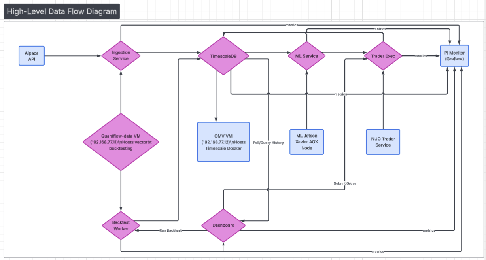

# Homelab Infrastructure

A multi-node homelab built for quantitative market analysis, ML inference, and media serving. This repo documents the architecture, configuration patterns, and lessons learned from building a distributed compute environment on consumer hardware.

> **Note:** This repo contains infrastructure documentation and sanitized configuration templates. The application layer (trading platform, analytics dashboard, ML pipelines) lives in private repos.

---

## Architecture

<p align="center">
  
  <br/>
  <em>High-level data flow across the distributed node cluster</em>
</p>

---

## Storage

### ZFS Pool (NAS — OMV VM)

```
quantpool (RAIDZ2, 8×SATA)
├── market_data_daily/     # Daily OHLCV bars
├── market_data_minute/    # Minute-level bars
├── market_data_tick/      # Tick data (when available)
├── backtests/             # Backtest artifacts (RW)
└── models/                # ML model checkpoints (RW)

Config: compression=lz4, atime=off, xattr=sa, recordsize=128k
```

### NFS Exports

Market data is exported **read-only** to compute nodes. Backtest artifacts and model storage are read-write.

```bash
# On compute nodes (/etc/fstab):
# Market data — READ ONLY (enforced at mount)
<nas-ip>:/export/market_data_daily   /mnt/quantdata/daily    nfs4  defaults,ro,nofail  0 0
<nas-ip>:/export/market_data_minute  /mnt/quantdata/minute   nfs4  defaults,ro,nofail  0 0

# Artifacts — READ WRITE
<nas-ip>:/export/backtests           /mnt/backtests           nfs4  defaults,nofail     0 0
<nas-ip>:/export/models              /mnt/quantdata/models    nfs4  defaults,nofail     0 0
```

**Design principle:** Market data is the source of truth — no compute node can accidentally write to it. Only the data ingestion pipeline on the NAS VM has write access.

### NVMe Tiering

| Tier | Location | Purpose |
|------|----------|---------|
| Hot | NAS 1TB NVMe L2ARC | ZFS read cache for frequent time-series queries |
| Warm | NAS 3TB NVMe | Active time-series data, VM disks |
| Local hot | Each NUC 4-8TB NVMe | Node-local datasets, execution logs, research data |
| Archive | ZFS RAIDZ2 pool | Long-term storage, cold data |

## Proxmox Configuration

### VM Layout

```
Proxmox Host (bare metal)
├── VM 101: Ubuntu Server (app server + API)
│   └── 10 cores, 16GB RAM, 50GB disk
├── VM 102: OpenMediaVault (storage management)
│   └── 6 cores, 16GB RAM, 50GB disk
│   └── ZFS pool passthrough
│   └── Docker: TimescaleDB container
└── Resources: ~6GB RAM for Proxmox itself
    Ballooning enabled on both VMs
```

**Why TimescaleDB on ZFS?** The database volume maps directly to the ZFS pool, so we get compression, snapshots, and RAIDZ2 redundancy for free. No separate backup strategy needed for the DB — ZFS snapshots handle it.


## What This Powers

The infrastructure supports a private quantitative trading platform with:
- Real-time market data ingestion and storage (~50K+ FRED observations, multi-timeframe OHLCV)
- Full-stack analytics dashboard (FastAPI + React + TypeScript)
- Backtesting engines with artifact storage
- ML inference pipeline (LLM + FinBERT on Jetson GPU)
- Network-wide health monitoring

